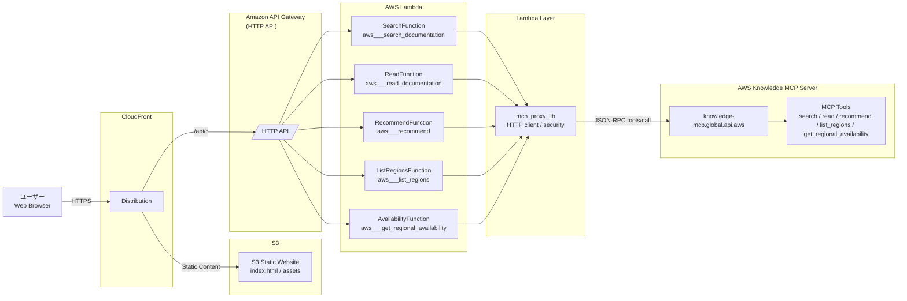

# AWS Knowledge MCP Browser UI (Serverless, low-cost)

This repository deploys a **browser UI** and a **serverless proxy** for the **AWS Knowledge MCP Server** (remote MCP via Streamable HTTP at `https://knowledge-mcp.global.api.aws`).  
The UI lets users pick one of the following MCP tools and run it:

- `search_documentation`
- `read_documentation`
- `recommend`
- `list_regions`
- `get_regional_availability`

## Architecture

- CloudFront (optional but included) with two origins:
  - S3 static website (UI)
  - API Gateway HTTP API via `/api/*`
- API Gateway (HTTP API) -> Lambda (Python)



## Endpoints

| Endpoint | MCP Tool | 機能概要（日本語要約） |
| ---| ---| --- |
| `POST /api/search` | `aws___search_documentation` | Searches the entire AWS official documentation and returns up to **10** highly relevant results. You can narrow the search scope by specifying a topic. |
| `POST /api/read` | `aws___read_documentation` | Retrieves the content of the specified AWS documentation URL and returns it converted into readable Markdown format. |
| `POST /api/recommend` | `aws___recommend` | Based on the specified AWS documentation page, it retrieves highly relevant recommended documentation. |
| `POST /api/list_regions` | `aws___list_regions` | Retrieves a list of all regions provided by AWS and returns the region codes and names. |
| `POST /api/get_regional_availavility` | `aws___get_regional_availability` | Determines whether AWS services, APIs, and CloudFormation resources are **available** in the specified region and returns their availability status. |

## Deploy using AWS SAM

note: `OriginVerifySecret` defines the value of the X-Origin-Verify header used to enforce connection restrictions to the API Gateway.

```bash
$ sam deploy \
  --stack-name aws-knowledge-mcp-server-tool \
  --region ap-northeast-1 \
  --s3-bucket aws-sam-cli-managed-default-YOUR_AWS_ACCOUNT \
  --capabilities CAPABILITY_IAM \
  --profile YOUR_AWS_PROFILE \
  --parameter-overrides \
    OriginVerifySecret="YOUR_SECRET_VALUE"
```

**Parameters you will be asked:**

- `OriginVerifySecret` (optional): if set, the UI must send `X-Shared-Token` header

**After deploy, SAM outputs:**

- `WebUrl` (CloudFront URL)
- `ApiBaseUrl` (API Gateway base URL)

### Notes

- The AWS Knowledge MCP Server does **not** require auth but is subject to rate limits.
- This project keeps state minimal. Lambda will keep an MCP session-id in-memory per warm container and re-initialize when needed.

### Upload UI

`aws s3 cp index.html s3://<WebBucketName>/index.html --profile YOUR_AWS_PROFILE`

### Delete Cashe in CloudFront if you need

If the UI does not change after uploading the UI, please execute it.

```bash
aws cloudfront create-invalidation \
  --distribution-id <WebDistributionId> \
  --paths "/*" \
  --profile YOUR_AWS_PROFILE
```

### Register your domain  

You can access CloudFront using its DNS name without registering a domain.  
If you can register your domain in route 53 public host zone.  
Recommend Alias Record.

## How to debug

### Check the connectivity using the Inspector

`$ npx @modelcontextprotocol/inspector https://knowledge-mcp.global.api.aws`

- After run, Use Transport Type is Streamable HTTP.  
- URL is <https://knowledge-mcp.global.api.aws>.  
- Turn on connect.  

### How to debug using curl

- search_documentation

```bash
curl -sS https://knowledge-mcp.global.api.aws \
  -H "Content-Type: application/json" \
  -H "Accept: application/json" \
  -d '{"method":"tools/call","params":{"name":"aws___search_documentation","arguments":{"topics":["general"],"limit":10,"search_phrase":"IAMの仕組"},"_meta":{"progressToken":3}},"jsonrpc":"2.0","id":1}'
```

- read_documentation

```bash
curl -sS https://knowledge-mcp.global.api.aws \
  -H "Content-Type: application/json" \
  -H "Accept: application/json" \
  -d '{"method":"tools/call","params":{"name":"aws___read_documentation","arguments":{"url":"https://docs.aws.amazon.com/IAM/latest/UserGuide/introduction.html","max_length":2000}},"jsonrpc":"2.0","id":1}'
```

- recommend

```bash
curl -sS https://knowledge-mcp.global.api.aws \
  -H "Content-Type: application/json" \
  -H "Accept: application/json" \
  -d '{"method":"tools/call","params":{"name":"aws___recommend","arguments":{"url":"https://docs.aws.amazon.com/IAM/latest/UserGuide/introduction.html"}},"jsonrpc":"2.0","id":1}'
```

- list_regions

```bash
curl -sS https://knowledge-mcp.global.api.aws \
  -H "Content-Type: application/json" \
  -H "Accept: application/json" \
  -d '{
    "jsonrpc": "2.0",
    "id": 1,
    "method": "tools/call",
    "params": {
      "name": "aws___list_regions",
      "arguments": {},
      "_meta": {
        "progressToken": 1
      }
    }
  }'

```

- get_regional_availability

```bash
curl -sS https://knowledge-mcp.global.api.aws \
  -H "Content-Type: application/json" \
  -H "Accept: application/json" \
  -d '{
    "jsonrpc": "2.0",
    "id": 1,
    "method": "tools/call",
    "params": {
      "name": "aws___get_regional_availability",
      "arguments": {
        "region": "ap-northeast-1",
        "resource_type": "cfn",
        "filters": ["AWS::Lambda::Function"]
      },
      "_meta": {
        "progressToken": 2
      }
    }
  }'

```
